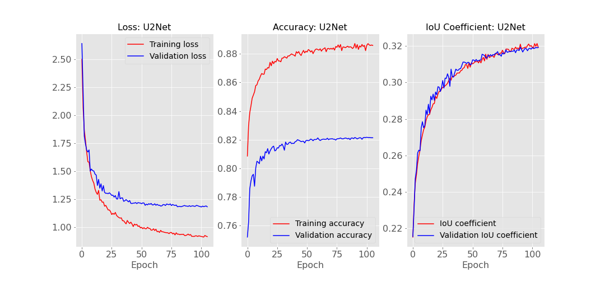
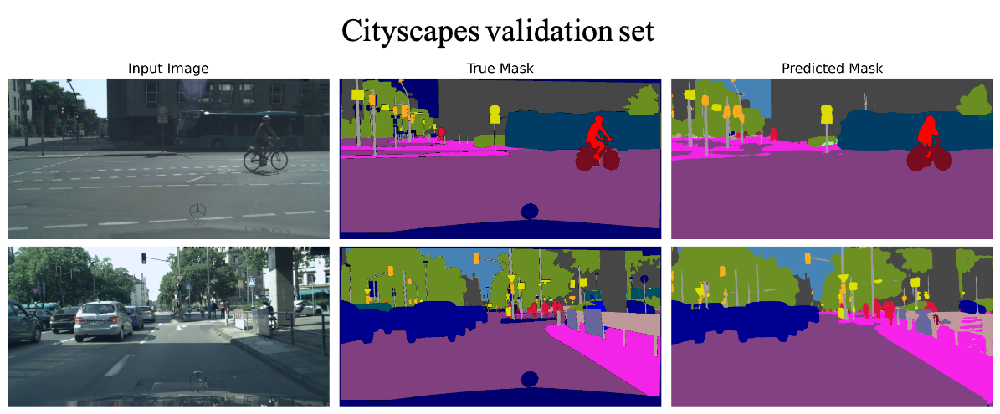
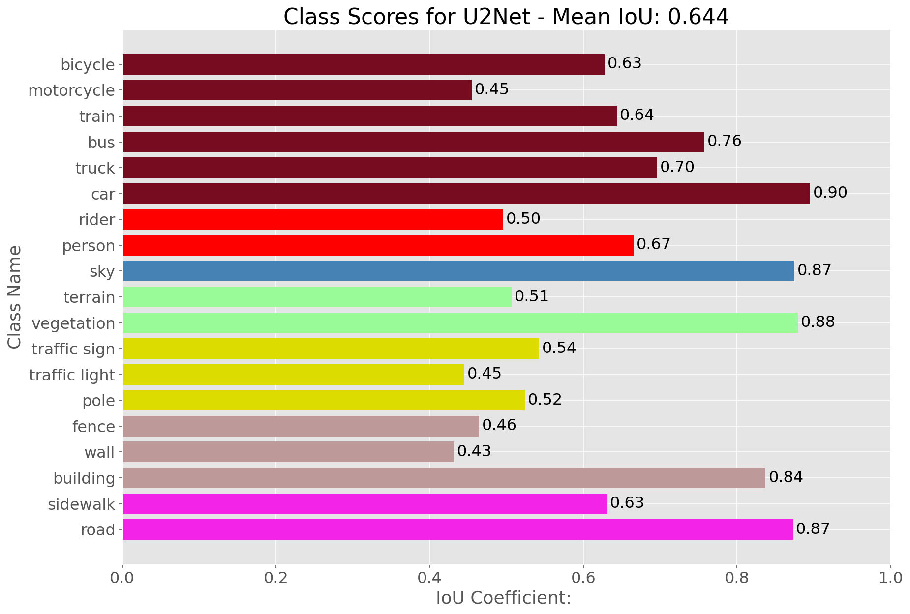
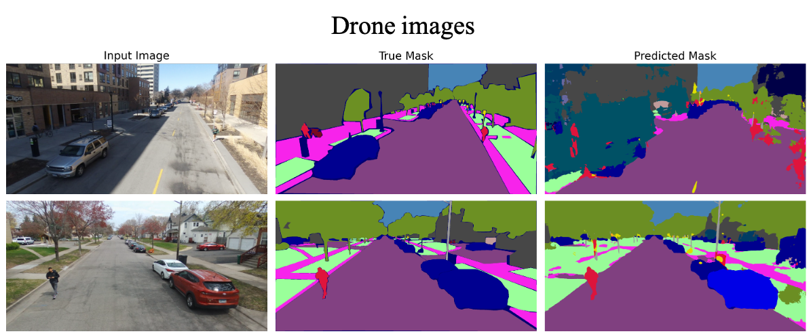
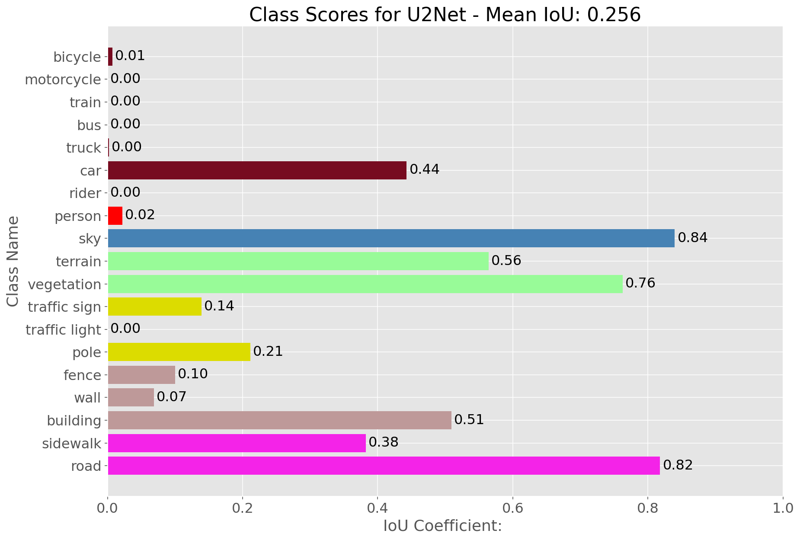

# Semantic Segmentation Pipeline

<!-- #region -->
This repository contains a combination of scripts for semantic segmentation and image classification in TensorFlow 2. Most of the semantic segmentation experiments are done on the Cityscapes dataset. 

### Contains Scripts for ...

- Configuring the Cityscapes dataset with custom semantic labels
- Converting a directory of images/masks into a TFRecords dataset file
- Training and evaluating semantic segmentation models
- Training and evaluating image classification models
- Training models using a custom training loop, where gradients are accumilated in order to have larger batch sizes

### Models

This repo contains a large collection of models for semantic segmentation and image classification, created using the TensorFlow functional API and the model subclassing API. A file that ends with `logits.py` means the model outputs class logits rather than softmax. 

#### Easy to Implement Models

Unet, Segnet, Bisnet, ERFNet, and U2Net are pretty straight forward to implement. Just import the model into `segmentation_model_training.ipynb` and run the jupyter notebook. U2Net, a very recent architecture made for saliant object detection, is by far the best performing model when evaluating over the validation set. It is a custom implementation, where I took the Pytorch code from the original [repo](https://github.com/xuebinqin/U-2-Net) converted it to TensorFlow, and changed it to be multi-class output.

#### HRNet

High-Resolution-Net (HRNet) is a state-of-the-art model architecture, with variants for semantic segmentation, image classification, object detection, and human pose estimation. The model was introduced in this [paper](https://arxiv.org/abs/1904.04514), where the authors demonstrated top performing results on the Cityscapes dataset for semantic segmentation (see [leaderboard](https://paperswithcode.com/sota/semantic-segmentation-on-cityscapes)).

Much of my work has been trying to replicate the results. This involed
- Converting the official Pytorch code to TensorFlow 2 (there is an [implementation](https://github.com/yuanyuanli85/tf-hrnet) that uses TensorFlow 1, but it is super confising and low-level). This was also done for the image-classification varient of HRNet.
- Configuring the data augmentation steps to follow the original paper - for image segmentation with the Cityscapes dataset and image classification with ImageNet. 
- Coming up with a way to properly evaluate the mean intersection over union, calculated over the validation set 
- Converting the semantic labels of the Cityscapes dataset from the 34 original classes to the 19 classes used for training and evaluation
- Figuring out how to train the models using the same batch size as in the paper, while using only a single consumer GPU (rather than 8xV100s). 

This repo should contain everything needed to replicate these results, but I have yet to complete a full training run on ImageNet (takes about one week). Training from scratch, however, has given a mIOU score of around 64% on the validation set. This falls slightly short of the results obtained from U2Net. 

#### Gradient Accumilation

My first attempt at gradient accumilation involved making a custom training loop (see `TrainAccumilator` in `train_utils.py`). This works fine, but involved a lot of tedious work to implement callbacks. A better approach is to create the model using the subclassing API, and then subclass the `train_step()` function to accumilate gradients. This allows for the model to be training using the standard `fit()` function. 


#### Vision Transformers

I have also been experimenting with vision transformers - both for image classification and sementic segmentation. This is a work in progress. 


### Results - U2Net

Cityscapes dataset training



Results on Cityscapes validation set





Results on drone dataset




<!-- #endregion -->

```python

```
